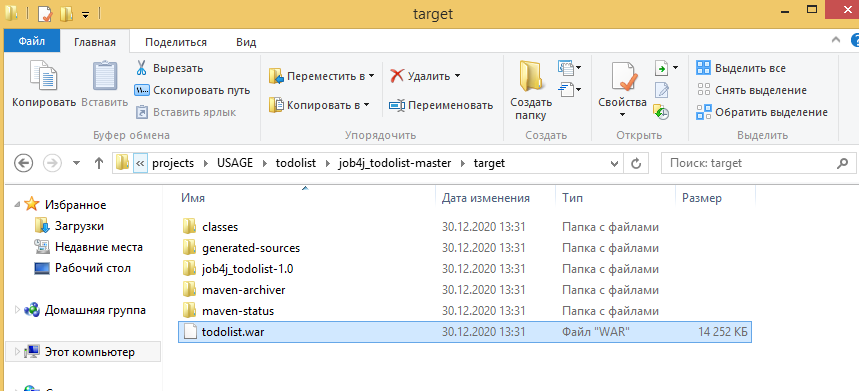

# Проект - TODO list

# Содержание
* [Использованные технологии](#Использованные-технологии)
* [О проекте](#О-проекте)
* [Сборка](#Сборка)
* [Использование](#Использование)
* [Контакты](#Контакты)
## Использованные технологии
* Servlets
* Hibernate (HQL)
* Collections Framework
* PostgreSQL
* Библиотека GSON
* SLF4J и Log4j
* AJAX
* JS, JQuery
* HTML, CSS, Bootstrap
* Travis CI
## О проекте
* Данное веб-приложение представляет собой сервис для работы с задачами. Является одностраничным приложением:  
  
* При добавлении задачи нужно добавить описание и выбрать категории задачи (можно выбрать несколько категорий), 
а также установить статус задачи (выполнена или нет)  
* Ниже в таблице можно сразу же просмотреть список всех добавленных задач. По умолчанию отображаются только невыполненные задачи. 
Для отображения всех задач (и выполненных, и невыполненных) нужно установить галку "Показать все". Также отображается автор задания.  
* Неавторизованные пользователи с приложением работать не могут. Форма авторизации:  
  
* Добавлена возможность регистрации новых пользователей. Форма регистрации:  
  
* Также реализована валидация всех форм приложения с помощью JS:
  
  
  
* Отображение списка категорий реализовано с помощью AJAX-запроса (типа POST) на сервлет CategoryServlet. 
Список категорий можно поменять (см. раздел "[Сборка](#Сборка)")  
* На страницах используется динамическое обновление контента с помощью технологии AJAX  
* Проект состоит из двух слоёв: слой контроллеров (реализован на сервлетах) и слой по работе с БД PostgreSQL  
* Работа с БД осуществляется через Hibernate  
* Авторизация построена на базе фильтра (класс AuthFilter) и сервлета (класс AuthServlet)   
* Для отображения авторизованного пользователя на главной странице используется AJAX-запрос на AuthServlet и объект Session  
* Работа с JSON-форматом производится с помощью библиотеки GSON  
* Страницы реализованы на HTML и Bootstrap. 
## Сборка
1. Установить JDK 14.
2. Скачать Maven.
3. Создать переменные окружения JAVA_HOME и M2_HOME и прописать в переменную окружения Path 
пути до бинарных файлов для JDK и для Maven:  
  
4. Установить сервер БД PostgreSQL. При установке задать: 
    * имя пользователя - postgres 
    * пароль - root
    * порт - 5432 
Также при установке сервера БД PostgreSQL нужно установить программу pg_Admin.

5. Скачать и установить Tomcat.
6. Скачать исходный код проекта с GitHub.
7. Перейти в корень проекта, где лежит файл pom.xml:  
  
  
8. С помощью Maven осуществить сборку проекта:  
  
При успешной сборке должна появиться папка target, в которой располагается war-архив:  
  
  
  
9. Переименовать war-архив:  
  
10. Запустить сервер БД, указав путь до папки data:  
  
11. Запустить программу pg_Admin, установленную вместе с сервером БД PostgreSQL:  
  
12. Создать БД с названием todolist:  
  
13. Открыть Query Tool для созданной БД и запустить SQL-скрипт create.sql, 
находящийся в папке db (данная папка находится в корне скачанного проекта):  
  
  
Если нужно задать другой список категорий для задач, то нужно сделать это до запуска SQL-скрипта create.sql 
в следующих строчках скрипта:  
  
14. Задеплоить собранный war-архив в папку webapps, находящуюся в корневой папке скачанного Tomcat:  
  
Сборка завершена. Теперь можно проверить работу приложения.
## Использование
Запускаем Tomcat:  
  
  
Переходим на главную страницу приложения 
[http://localhost:8080/todolist/](http://localhost:8080/todolist/):   
  
Как видно, при попытке перехода на главную страницу приложения нас перекидывает на форму авторизации, что означает, 
что с приложением могут работать только авторизованные пользователи. Так как сейчас в БД нет ни одного 
зарегистрированного пользователя, то сначала необходимо зарегистрироваться:  
  
Теперь можно авторизоваться:  
  
  
Добавим невыполненную задачу:  
  
  
Добавим выполненную задачу:  
  
  
Для отображения выполненной задачи в таблице отметим галку "Показать все":  
  
Зарегистрируем другого пользователя и добавим несколько задач от его имени:  
  
  
Проверим валидацию. Для этого нажмём на кнопки отправки форм, при этом не заполнив поля форм:  
  
  
  
## Контакты
Почта: dmitry_yugay@mail.ru 
Skype: live:.cid.9cdc925fb48220b4
